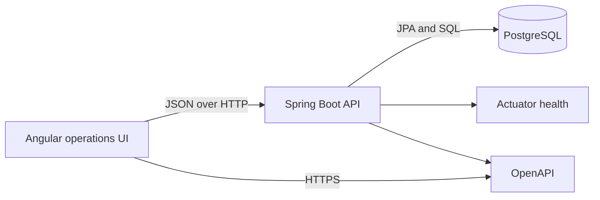
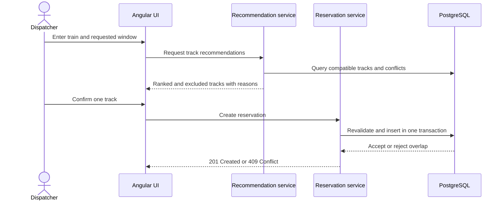

# Architecture

## System shape

The application is a modular monolith with three deployable processes:

A modular monolith keeps transaction and scheduling rules in one process while preserving explicit feature boundaries. It avoids the deployment and data-consistency overhead of microservices for a portfolio-scale system.

## Backend modules

| Module | Responsibility | Status |
|---|---|---|
| `yard` | Yard identity, location, time zone, and active status | Implemented |
| `track` | Track dimensions, purpose, status, buffers, and capabilities | Implemented |
| `train` | Train dimensions, service data, priority, and requirements | Implemented |
| `reservation` | Conflict-safe assignment and lifecycle rules | Placeholder |
| `recommendation` | Candidate filtering, ranking, and explanations | Placeholder |
| `audit` | Append-only records for operational changes | Placeholder (table present) |
| `common` | Shared errors, validation, time semantics, correlation IDs, OpenAPI, stable page serialization | Implemented |

Features own their controllers, services, persistence code, and DTOs. Controllers do not contain scheduling rules, and JPA entities are not exposed as API responses. The `common.web` package currently contains `CorrelationIdFilter`, `WebAutoConfiguration` (the `@RestControllerAdvice`), `PageSerializationConfiguration`, and `OpenApiConfiguration`. The `common.error` package contains the `ErrorCode` enum, `ApiErrorResponse` envelope, and the three domain exceptions (`ResourceNotFoundException`, `DuplicateResourceException`, `BusinessRuleException`).

## API surface currently exposed

| Method | Path | Purpose |
|---|---|---|
| `GET` | `/api/yards` | List yards in stable code order with pagination |
| `GET` | `/api/yards/{yardId}` | Fetch a single yard |
| `POST` | `/api/yards` | Create a yard |
| `PATCH` | `/api/yards/{yardId}` | Update a yard |
| `GET` | `/api/yards/{yardId}/tracks` | List tracks for a yard |
| `GET` | `/api/tracks?yardId=` | List all tracks, optionally filtered by yard |
| `GET` | `/api/tracks/{trackId}` | Fetch a single track |
| `POST` | `/api/yards/{yardId}/tracks` | Create a track in a yard |
| `PUT` | `/api/tracks/{trackId}` | Replace an existing track |
| `PATCH` | `/api/tracks/{trackId}/status?status=` | Update a track's operational status |
| `GET` | `/api/trains?query=` | List trains, with case-insensitive search |
| `GET` | `/api/trains/{trainId}` | Fetch a single train |
| `POST` | `/api/trains` | Create a train |
| `PUT` | `/api/trains/{trainId}` | Replace an existing train |
| `GET` | `/actuator/health` | Liveness and readiness probes |
| `GET` | `/v3/api-docs` | OpenAPI document |
| `GET` | `/swagger-ui/index.html` | Swagger UI |

## Scheduling request flow (planned)

A recommendation is advisory. Reservation creation always performs an authoritative recheck because availability can change between recommendation and confirmation.

## Runtime configuration

- The API reads connection details from environment variables (`SPRING_DATASOURCE_URL`, `SPRING_DATASOURCE_USERNAME`, `SPRING_DATASOURCE_PASSWORD`, `SERVER_PORT`).
- Flyway applies schema changes before JPA validation.
- PostgreSQL stores all operational timestamps as `TIMESTAMPTZ`; the API uses `Instant`; the UI will display the selected yard's IANA time zone.
- Docker Compose provides reproducible local services; GitHub Actions runs the same builds and tests.
- API errors are returned through the stable `ApiErrorResponse` envelope; every request and response carries a `X-Correlation-Id`.
