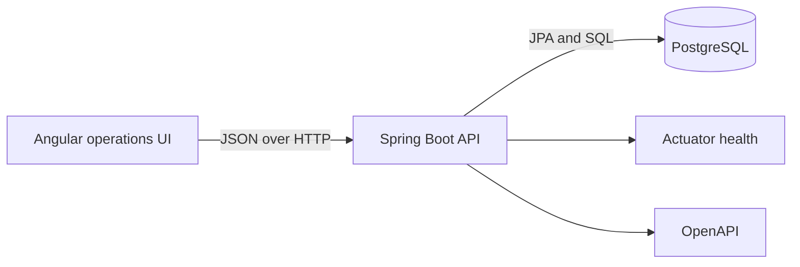
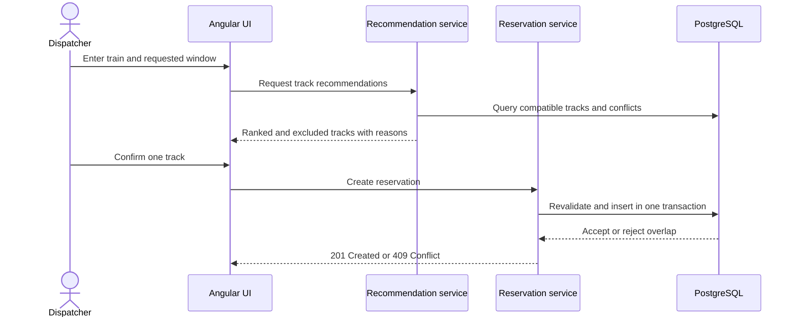

# Architecture

## System shape

The application is a modular monolith with three deployable processes:

A modular monolith keeps transaction and scheduling rules in one process while preserving explicit feature boundaries. It avoids the deployment and data-consistency overhead of microservices for a portfolio-scale system.

## Backend modules

| Module | Responsibility |
|---|---|
| `yard` | Yard identity, location, time zone, and active status |
| `track` | Track dimensions, purpose, status, buffers, and capabilities |
| `train` | Train dimensions, service data, priority, and requirements |
| `reservation` | Conflict-safe assignment and lifecycle rules |
| `recommendation` | Candidate filtering, ranking, and explanations |
| `audit` | Append-only records for operational changes |
| `common` | Shared errors, validation, time semantics, and API concerns |

Features own their controllers, services, persistence code, and DTOs. Controllers do not contain scheduling rules, and JPA entities are not exposed as API responses.

## Scheduling request flow

A recommendation is advisory. Reservation creation always performs an authoritative recheck because availability can change between recommendation and confirmation.

## Runtime configuration

- The API reads connection details from environment variables.
- Flyway applies schema changes before JPA validation.
- PostgreSQL stores all operational timestamps as `TIMESTAMPTZ`.
- The UI will display the selected yard's IANA time zone while the API uses UTC `Instant` values.
- Docker Compose provides reproducible local services; GitHub Actions runs the same builds and tests.
