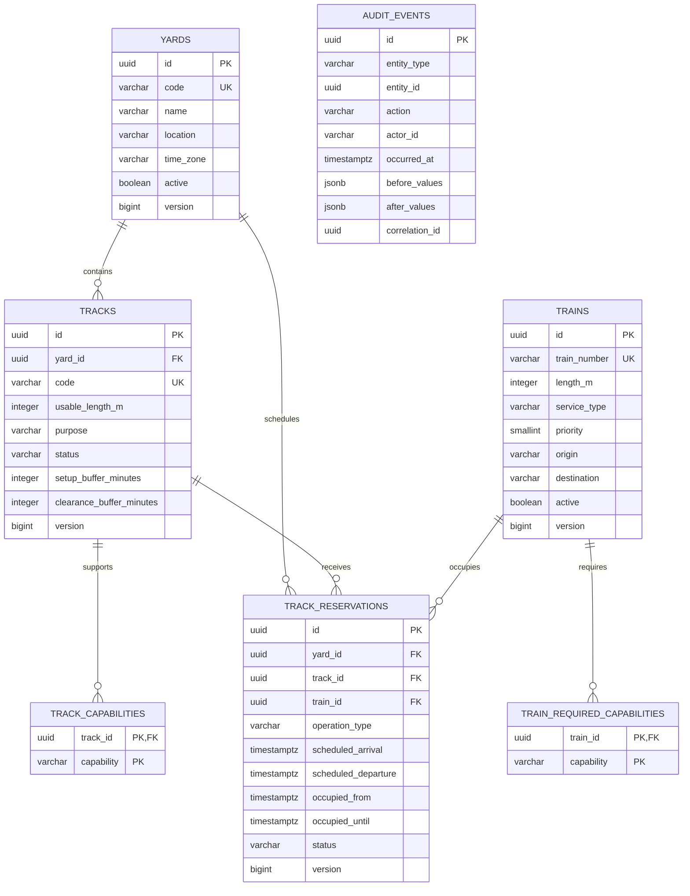

# Relational model

## Design notes

- Capability requirements are normalized rather than stored as comma-separated values or opaque JSON.
- `(track_id, yard_id)` has a composite foreign key so a reservation cannot claim a yard different from its track's yard.
- Requested and effective occupancy windows are both stored. Effective values include setup and clearance buffers and are used for conflict protection.
- `audit_events` uses JSON only for before/after snapshots; operational entities remain relational and queryable.
- Database check constraints protect lengths, priorities, statuses, and interval order independently of application validation.

The implemented source of truth is `backend/src/main/resources/db/migration/`.
